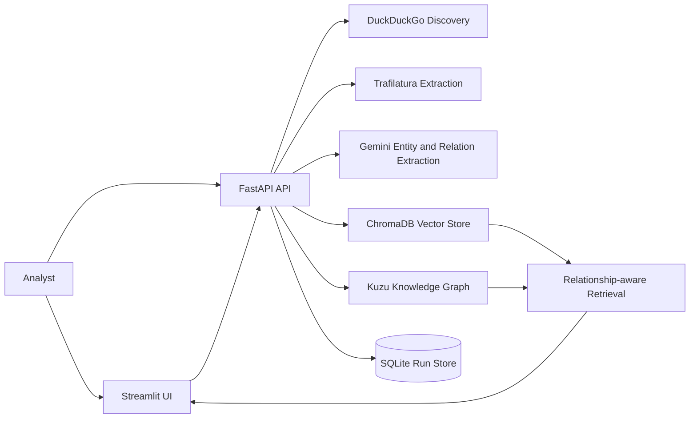
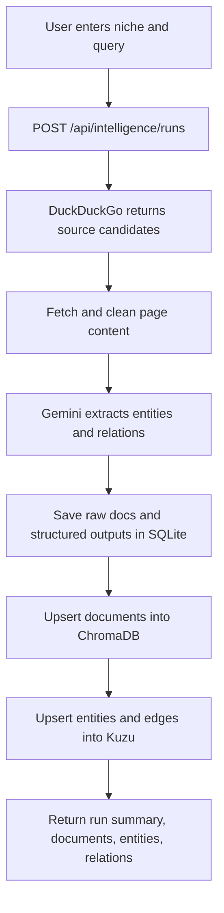
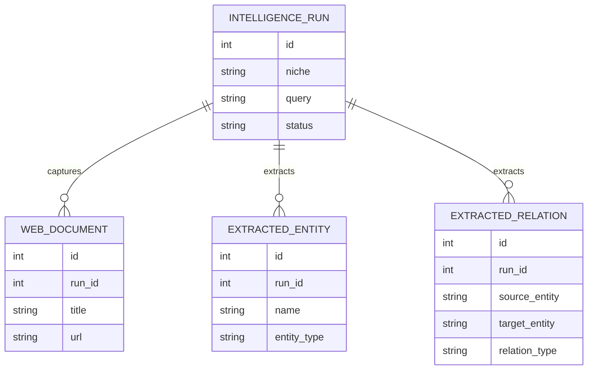

# CompetitorRecognition

CompetitorRecognition is an agentic web intelligence platform for discovering, scraping, and structuring web data into industry-specific relationship maps.

It combines search-driven source discovery, article extraction, schema-driven entity and relation extraction, vector retrieval, and graph storage so analysts can monitor a niche and query how companies, products, signals, and themes connect.

## What it does

- Discovers public web sources for a niche using DuckDuckGo search
- Scrapes and cleans article/page content with Trafilatura
- Extracts entities and relationships with Gemini using a structured JSON schema
- Stores document embeddings in ChromaDB for semantic retrieval
- Stores entity relationships in Kuzu for graph-style lookups
- Exposes the workflow through FastAPI and a Streamlit analyst UI

## Tech Stack

- `FastAPI`
- `Streamlit`
- `Trafilatura`
- `DuckDuckGo Search`
- `Gemini API`
- `ChromaDB`
- `Kuzu`
- `SQLite`

## Project layout

- `app/` contains the FastAPI app
- `app/api/` contains API routes
- `app/models/` contains SQLite models for runs, documents, entities, and relations
- `app/services/` contains search, scraping, extraction, vector, graph, and reporting logic
- `streamlit_app.py` provides the Streamlit analyst UI
- `app/templates/` and `app/static/` contain the lightweight FastAPI dashboard
- `scripts/seed_demo.py` creates a small sample dataset
- `data/` stores the local SQLite database

## Architecture



## Capture Flow



## Storage Model



## Local run

```powershell
python -m venv .venv
.venv\Scripts\Activate.ps1
pip install -e .[dev]
Copy-Item .env.example .env
```

Set `GEMINI_API_KEY` in `.env` if you want Gemini extraction.

### Start FastAPI

```powershell
uvicorn app.main:app --reload
```

Open `http://127.0.0.1:8000`.

### Start Streamlit

```powershell
streamlit run streamlit_app.py
```

Open `http://localhost:8501`.

## Basic workflow

1. Start the app.
2. Open the Streamlit UI.
3. Enter a niche and a search query.
4. Run an intelligence capture.
5. Review discovered documents, extracted entities, and graph relationships.
6. Use relationship-aware queries against the stored vector and graph indexes.

## API endpoints

- `GET /api/health`
- `GET /api/intelligence/runs`
- `GET /api/intelligence/runs/{run_id}`
- `POST /api/intelligence/runs`
- `POST /api/intelligence/query`
- `GET /api/niches`
- `POST /api/niches`
- `POST /api/niches/bootstrap`
- `POST /api/niches/{niche_id}/companies`
- `POST /api/companies/{company_id}/sources`
- `POST /api/jobs/run-daily`
- `GET /api/tasks`
- `POST /api/niches/{niche_id}/tasks`
- `GET /api/reports`
- `POST /api/tasks/{task_id}/run-basic-report`
- `POST /api/tasks/{task_id}/run-detailed-report`
- `GET /api/niches/{niche_id}/training-export`
