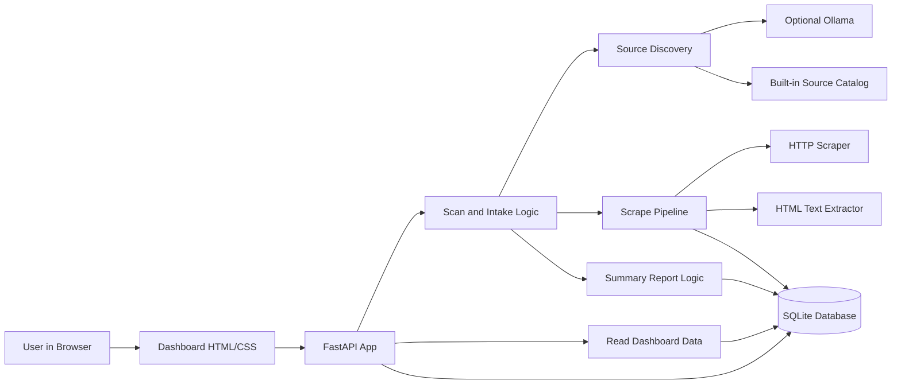
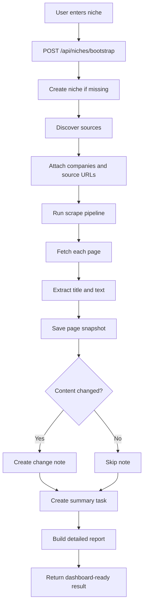
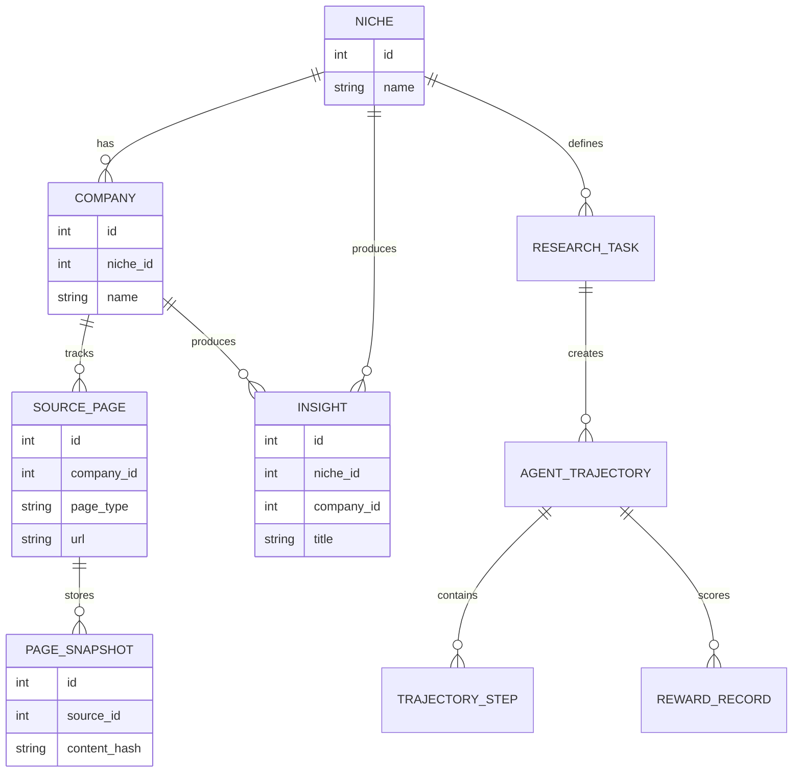

# Competitor Watch

This is a small FastAPI app for tracking public competitor or market pages.

You enter a niche, the app builds a starter source list, scrapes those pages, stores snapshots in SQLite, and writes short change notes when page content changes.

## What it does

- Track niches such as `tech`, `oil and gas`, or `sales software`
- Find a basic set of public sources from a built-in catalog
- Optionally add more sources from a local Ollama instance
- Scrape pages and save snapshots
- Create plain notes when a page changes
- Show recent niches, notes, and scrape runs in a small dashboard

## Project layout

- `app/` contains the FastAPI app
- `app/api/` contains API routes
- `app/models/` contains database models
- `app/services/` contains discovery, scraping, and note-building logic
- `app/templates/` and `app/static/` contain the dashboard UI
- `scripts/seed_demo.py` creates a small sample dataset
- `data/` stores the local SQLite database

## Architecture



## Scan Flow



## Data Model



## Local run

```powershell
python -m venv .venv
.venv\Scripts\Activate.ps1
pip install -e .[dev]
Copy-Item .env.example .env
uvicorn app.main:app --reload
```

Open `http://127.0.0.1:8000`.

## Basic flow

1. Start the app.
2. Open the dashboard.
3. Enter a niche.
4. Run a scan.
5. Review the saved sources and notes.

## Optional Ollama setup

If you want extra source suggestions, run Ollama locally:

```powershell
ollama serve
ollama pull llama3.2
```

Then set:

```powershell
DISCOVERY_STRATEGY=hybrid
OLLAMA_MODEL=llama3.2
```

## API endpoints

- `GET /api/health`
- `GET /api/niches`
- `POST /api/niches`
- `POST /api/niches/bootstrap`
- `POST /api/niches/{niche_id}/companies`
- `POST /api/companies/{company_id}/sources`
- `POST /api/jobs/run-daily`
- `GET /api/tasks`
- `POST /api/niches/{niche_id}/tasks`
- `GET /api/reports`
- `POST /api/tasks/{task_id}/run-basic-report`
- `POST /api/tasks/{task_id}/run-detailed-report`
- `GET /api/niches/{niche_id}/training-export`
